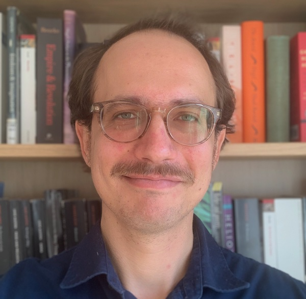

I am Assistant Professor of Digital Humanities at the University of Cambridge, where I teach for [Cambridge Digital Humanities](https://www.cdh.cam.ac.uk/about/people/dr-ryan-heuser/) and the [Faculty of English](https://www.english.cam.ac.uk/people/Ryan.Heuser). I am a literary historian and computational humanist with over fifteen years’ experience in researching and teaching in the digital humanities.

My work applies computational methods to cultural history while conversely bringing the critical methods of cultural studies to bear on computation. I have written on topics from the [‘generative aesthetics’ of large language models](https://culturalanalytics.org/article/id/1036/) to [computational models of poetic rhythm](https://journals.linguisticsociety.org/proceedings/index.php/amphonology/article/view/3679) and the [degree of linguistic ‘abstraction’ in literary](/talks/kingscollege2020/) and [intellectual history](https://www.cambridge.org/core/books/explorations-in-the-digital-history-of-ideas/computing-koselleck-modelling-semantic-revolutions-17201960/1ED34828C706CB5A7882E0A825C6F72F).

I completed my PhD in English from Stanford University in 2019, where I was a founding member of the [Stanford Literary Lab](https://litlab.stanford.edu) and its Associate Research Director from 2011 to 2015. From 2019-2022 I was a postdoc in King's College, Cambridge, where I am now a fellow; and from 2022-2024 I was Research Software Engineer in Princeton's [Center for Digital Humanities](https://cdh.princeton.edu/) and KCL’s [King’s Digital Lab](https://kdl.kcl.ac.uk/).

You can find me at [Cambridge](https://www.english.cam.ac.uk/people/Ryan.Heuser), [CDH](https://www.cdh.cam.ac.uk/about/people/dr-ryan-heuser/), [Github](http://github.com/quadrismegistus), [Google Scholar](https://scholar.google.com/citations?user=EEy82P4AAAAJ), [Bluesky](https://bsky.app/profile/heuser.bsky.social), or by email at [rj416@cam.ac.uk](mailto:rj416@cam.ac.uk).
